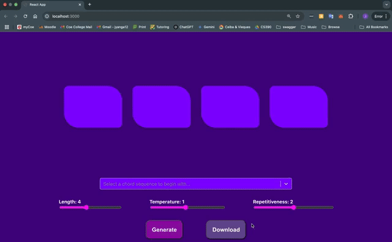

# 🎶 Chord Generator: AI-Powered Chord Progressions
  

  

  

## Overview
The Chord Generator is an AI-powered tool that creates musical chord progressions based on user inputs. Using an LSTM-based model, the app generates unique and harmonically pleasing sequences, offering musicians a quick and intuitive way to experiment with new ideas. Whether you're a seasoned composer or a beginner, the Chord Generator helps spark creativity and simplify the music creation process.

As someone with a long-time passion for music production, I developed this project to combine my technical skills with my love for music. This tool is designed to assist musicians and producers by providing an automated yet creative way to explore chord structures and experiment with different harmonic progressions.

### Features
  - AI-Powered Chord Generation – Generates chord progressions based on input parameters.
  - User Input Options – Customize progression length, temperature, repetitiveness, and more.
  - Realistic Harmonics – Trained on MIDI files to produce musically sound results.
  - Easy-to-Use Interface – Intuitive web app interface for seamless chord exploration.

### Tech Stack
  - Frontend: React.js
  - Backend: Flask (Python)
  - Machine Learning: Tensorflow, LSTM (Long Short-Term Memory) Model
  - Data: Lakh MIDI dataset (176,581 unique MIDI files)
  - Model Deployment: Pickle (model.pkl, scaler.pkl)

### How It Works
  - Input Parameters – Length, Temperature, Repetitiveness
  - Chord Generation – The AI model generates a progression based on trained data.
  - Download – Download the progression as a MIDI file.
  - Export - Drag and drop directly into your music production software (DAW)

### Inspiration Behind the Project
As a music producer with years of hands-on experience, I’ve always been fascinated by how chord progressions shape the emotional impact of a song. While traditional methods of composing can be time-consuming and confusing, I wanted to create a tool that could help musicians experiment with harmonic ideas without being constrained by the technicalities of music theory. This project merges artistic intuition with machine learning, giving users the ability to create musical ideas quickly and efficiently.

### Future Enhancements
  - Expanded User Inputs – Add more parameters like key, scale, mood, and genre for more tailored progressions.
  - More instruments - Add models for generation of drums, bass, keys, etc.

🚀 Want to Contribute?
Fork the repo, experiment with the AI model, or suggest new features!
